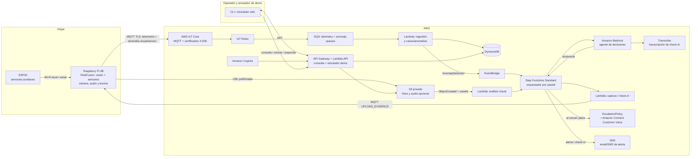

# SenseCare — Arquitectura AWS para el MVP

## Propósito y alcance

SenseCare monitoriza de forma consentida a una persona en su hogar. El ESP32 entrega sensores auxiliares a una Raspberry Pi 4B por red local o serial. La Pi es el gateway: ejecuta de forma continua detectores visuales ligeros, un motor de fusión temporal de riesgos (`RiskFusionEngine`) y reglas de sensores; integra cámara, micrófono y bocina, y se conecta a AWS. El video nunca se transmite de forma continua; un candidato de riesgo visual **o de sensor** puede activar el envío puntual de una imagen para análisis multimodal en AWS.

El MVP puede hacer una llamada de *fallback* al número autorizado para el demo, nunca al 911. Como último recurso, el agente puede invocar la herramienta controlada `emergency_call`; ésta sólo marca tras comprobar riesgo alto, consentimiento explícito, falta de respuesta de la persona y de los familiares alertados, destino permitido e idempotencia. No es una capacidad de telefonía abierta del LLM.

## Arquitectura propuesta

Diagrama editable con iconos oficiales: [aws-architecture-mvp.svg](../diagrams/aws-architecture-mvp.svg).



La Raspberry Pi es el gateway deliberado: evita ejecutar visión, cámara, audio, subidas pesadas o lógica de nube en el ESP32. En una versión futura puede sustituirse por hardware edge con acelerador, sin cambiar los contratos con AWS.

## Componentes

| Necesidad | Servicio / componente | Decisión para el MVP |
| --- | --- | --- |
| Gateway y detección inicial | Raspberry Pi 4B | Recibe ESP32, ejecuta visión local por secuencia, `RiskFusionEngine` y reglas locales de sensores; integra cámara/audio. |
| Fuente visual de demo | Cámara real de la Pi | La cámara observa una habitación real o una animación reproducida en una pantalla. No se envían eventos visuales directamente desde la animación a AWS. |
| Identidad y conectividad del gateway | AWS IoT Core | Un `Thing` y certificado X.509 por Raspberry Pi; MQTT sobre TLS. |
| Ingreso confiable de telemetría y anomalías | IoT Rule + SQS | Colas separadas desacoplan telemetría y ambos tipos de anomalía de la lógica y permiten reintentos. |
| Datos de consulta rápida | DynamoDB | Estado actual, lecturas recientes, alertas, usuarios y vínculos de cuidado. |
| Evidencia multimedia | S3 privado | Sólo una foto puntual tras anomalía y consentimiento de cámara; URL prefirmada, sin acceso público y borrado automático. |
| Orquestación de caso | Step Functions Standard | Ejecución durable por `caseId`: espera foto y respuestas, mide plazos y mantiene la historia del caso. |
| Coordinación de eventos | EventBridge | Inicia la ejecución y activa el watchdog de inactividad; no almacena ni espera estado. |
| Interpretación y decisión | Bedrock + despachador de herramientas | El agente propone severidad o evidencia adicional; no puede cerrar ni evitar el escalamiento por sí solo. |
| Escalamiento telefónico | Step Functions + EscalationPolicy + Amazon Connect Customer (Voice) | El timeout lleva siempre a la política determinista; el agente puede pedirlo antes, pero no es requisito para el fallback. |
| API de control y simulación | API Gateway + Lambda | REST autorizada por Cognito/rol demo: consulta casi en tiempo real, acciones humanas y adaptador de simulador web. |
| Login y roles | Cognito | Roles mínimos: `caregiver` y `admin`; el usuario sólo accede a sus pacientes/dispositivos. |
| Alertas | SNS (MVP) | Email/SMS para demo; API/CLI consulta casos y telemetría. |

AWS IoT Core usa MQTT y su Rules Engine puede enrutar mensajes hacia S3, DynamoDB, Lambda o SQS; aquí se elige SQS antes de Lambda para tolerar picos y errores transitorios. [Documentación de AWS IoT Core](https://docs.aws.amazon.com/iot/latest/developerguide/aws-iot-how-it-works.html)

## Flujos principales

### 1. Telemetría, consulta casi en tiempo real y detección local

1. El ESP32 envía lecturas a la Raspberry Pi por Wi-Fi local o serial. La Pi las normaliza con su `deviceId`, timestamp UTC y estado del modelo local.
2. La Pi publica cada 30–60 segundos la telemetría consolidada a AWS IoT Core mediante MQTT TLS, usando su certificado X.509. El perfil `demo` puede reducirlo a 5 segundos; no cambia el contrato.
3. Una regla IoT envía el mensaje a SQS. Lambda valida el esquema, deduplica por `eventId`, persiste la lectura y actualiza el estado actual.
4. La cámara real de la Pi observa el entorno físico o la animación reproducida en una pantalla. El mismo pipeline recibe ambos: no existe un atajo de eventos visuales de la animación hacia AWS.
5. La Pi combina pose, detección de persona/objeto, detector especializado de humo/fuego cuando exista y señales de salud de cámara. `RiskFusionEngine` exige evidencia temporal antes de publicar `visual.anomaly.detected`: `POSSIBLE_FALL`, `PERSON_PRONE_INACTIVE`, `UNEXPECTED_PERSON`, `POSSIBLE_SMOKE_OR_FIRE` o `CAMERA_TAMPERED`.
6. La Pi publica `sensor.anomaly.detected` cuando las reglas locales detectan una condición sostenida o crítica. Ambos tipos son disparadores de caso y cada uno aporta contexto al otro.
7. Los nombres son candidatos de riesgo: `UNEXPECTED_PERSON` no identifica ni acusa a un intruso; `PERSON_PRONE_INACTIVE` no diagnostica desmayo; `POSSIBLE_SMOKE_OR_FIRE` no sustituye un detector certificado.
8. `Devices` conserva la última lectura y `Telemetry` el historial. El operador consulta `GET /devices/{deviceId}/latest` o `GET /devices/{deviceId}/telemetry?from=&to=`; para depuración puede observar el topic autorizado desde MQTT Test Client. La entrega a DynamoDB es casi en tiempo real (normalmente segundos), no una garantía de tiempo real duro.
9. El simulador web se limita a manipular los sensores/escenario visual y consultar el backend. Si requiere emitir una anomalía de sensor no visual, usa `POST /demo/devices/{deviceId}/events`, autenticado y limitado a IDs de demo; `demoIngestHandler` valida el mismo schema y publica al mismo SQS que las IoT Rules.

### 2. Investigación de una anomalía

1. El evento visual o de sensor abre/reutiliza un `AnomalyCase`; EventBridge inicia una ejecución **Step Functions Standard** nombrada con el `caseId`.
2. Para anomalía visual, la Pi conserva en memoria el frame asociado. Para una anomalía de sensor, la máquina puede solicitar un frame actual puntual y fresco. Tras comprobar consentimiento de cámara, envía `UPLOAD_EVIDENCE` con `commandId`, `caseId`, `captureMode` (`BUFFERED` o `CURRENT`), URL prefirmada, llave S3 y vencimiento. Sólo entonces la Pi sube esa foto puntual. Los tokens internos de callback de Step Functions nunca salen de AWS.
3. `visionProcessor` asocia la imagen al `caseId` y devuelve la observación a la ejecución. Sólo entonces se invoca Bedrock con evidencia estructurada.
4. Un error, timeout o incertidumbre del análisis significa `uncertain`, nunca `safe` ni cierre automático.

### 3. Alerta y confirmación

1. La máquina inicia en paralelo un check-in de voz y alerta a los familiares. Ambos usan callback con `taskToken` y comparten el plazo `x`.
2. El check-in de la persona es evidencia y un familiar autorizado puede enviar `CANCEL_ALERT` o `ESCALATE`. La IA no puede emitir esas decisiones.
3. Sólo `CANCEL_ALERT` de un familiar autorizado resuelve el fallback; el check-in no lo cancela por sí solo y el LLM no puede bajar severidad ni cerrar el caso.
4. Al vencer el plazo sin `CANCEL_ALERT`, Step Functions llama **siempre** a `EscalationPolicy`. Sólo ésta permite a `EmergencyDialer` usar Amazon Connect Customer (Voice), tras comprobar consentimiento, riesgo, allowlist e idempotencia.

## Contratos MQTT iniciales

| Dirección | Topic |
| --- | --- |
| ESP32 → Raspberry Pi | Enlace local Wi-Fi, HTTP o serial; nunca llega directo a AWS. |
| Raspberry Pi → nube | `SenseCare/v1/devices/{deviceId}/telemetry` |
| Raspberry Pi → nube | `SenseCare/v1/devices/{deviceId}/visual/anomaly` |
| Raspberry Pi → nube | `SenseCare/v1/devices/{deviceId}/sensor/anomaly` |
| Raspberry Pi → nube | `SenseCare/v1/devices/{deviceId}/status` |
| Nube → gateway | `SenseCare/v1/devices/{deviceId}/commands` |
| Gateway → nube | `SenseCare/v1/devices/{deviceId}/command-acks` |
| Gateway → nube | `SenseCare/v1/devices/{deviceId}/evidence` |

Ejemplo de telemetría:

```json
{
  "eventId": "550e8400-e29b-41d4-a716-446655440000",
  "deviceId": "pi-demo-01",
  "occurredAt": "2026-09-23T18:30:00Z",
  "temperatureC": 27.3,
  "humidityPct": 48.1,
  "co2Ppm": 840,
  "proximityCm": 120,
  "motion": false,
  "firmwareVersion": "0.1.0"
}
```

Ejemplo de candidato visual, sin frame ni video en MQTT:

```json
{
  "eventId": "uuid",
  "eventType": "VISUAL_ANOMALY",
  "deviceId": "pi-demo-01",
  "occurredAt": "2026-09-23T18:30:00Z",
  "anomalyType": "PERSON_PRONE_INACTIVE",
  "confidence": 0.87,
  "candidates": ["POSSIBLE_FALL", "POSSIBLE_UNCONSCIOUSNESS"],
  "evidence": { "personCount": 1, "zone": "living_room", "horizontalSeconds": 14, "motionAfterSeconds": 12 },
  "modelVersions": { "pose": "pose-v1", "person": "person-v1" }
}
```

No almacenar audio continuo en el MVP. Si se habilita voz, guardar sólo comandos activados intencionalmente (push-to-talk o palabra de activación), con aviso y consentimiento visible.

## Modelo de datos DynamoDB

| Tabla | PK / SK | Contenido |
| --- | --- | --- |
| `CareRecipients` | `recipientId` | Perfil mínimo, zona horaria y consentimientos granulares (`camera`, `voice`, `fallbackCall`). |
| `Devices` | `deviceId` | Estado, último contacto, `recipientId`, versión, configuración. |
| `Telemetry` | `deviceId` / `timestamp#eventId` | Lecturas normalizadas; TTL de 30–90 días para MVP. |
| `Alerts` | `recipientId` / `createdAt#alertId` | Severidad, evidencia, estado, confirmación y auditoría. |
| `Observations` | `recipientId` / `capturedAt#imageId` | Resultado visual, `caseId` y llave S3 con `caseId`. |
| `AnomalyCases` | `caseId` | Estado, evidencia, `executionArn`, task tokens cifrados, plazos y resultado. |
| `OpenCaseLocks` | `recipientId#anomalyType` | Candado condicional con TTL para impedir casos duplicados. |
| `EventLog` | `caseId` / `timestamp#eventId` | Trazabilidad de decisiones, herramientas, alertas y respuestas, sin material biométrico crudo. |
| `CaregiverAccess` | `userId` / `recipientId` | Relación uno-a-muchos de familiares, rol, prioridad y preferencias de alerta. |

## Motor de anomalías: MVP

La Pi ejecuta reglas interpretables, configurables y con ventana temporal para visión y sensores. Para visión: pose + transición vertical/horizontal + inmovilidad (`POSSIBLE_FALL`/`PERSON_PRONE_INACTIVE`), persona en zona/horario armado (`UNEXPECTED_PERSON`), detector especializado de humo/fuego (`POSSIBLE_SMOKE_OR_FIRE`) y fallo/oclusión de cámara (`CAMERA_TAMPERED`). Para sensores: CO₂ alto sostenido (`POOR_AIR_QUALITY`), temperatura fuera de rango/ascenso rápido (`TEMPERATURE_ALERT`), y fallo de sensor (`SENSOR_FAULT`). Si se instala hardware específico, puede emitir `POSSIBLE_CO_EXPOSURE`, `POSSIBLE_GAS_LEAK` o `POSSIBLE_FIRE`; son señales de demo, no sustitutos de detectores certificados. Una regla debe exigir duración, histéresis/cooldown y validación de rango, no reaccionar a una lectura/frame aislado.

Los eventos de sensor de severidad alta alertan a familiares inmediatamente y solicitan evidencia visual como enriquecimiento bajo consentimiento. Bedrock puede aportar contexto, pero no puede rebajar automáticamente una condición crítica de sensor. CO₂ sólo se trata como indicador de ventilación; no se usa para declarar incendio, monóxido de carbono o fuga de gas. Véase [CDC/NIOSH sobre CO₂ y ventilación](https://www.cdc.gov/niosh/ventilation/faq/index.html) y [CDC sobre monóxido de carbono](https://www.cdc.gov/carbon-monoxide/es/about/informacion-basica-sobre-el-monoxido-de-carbono.html).

**Después:** guardar telemetría etiquetada y entrenar/pilotear detección de anomalías por persona. No presentar un modelo como diagnóstico médico ni actuar sólo por una predicción sin una política de seguridad.

## Seguridad, privacidad y costos

- Consentimiento revocable por persona monitoreada, incluyendo consentimiento independiente para cámara, voz y llamada de fallback; indicador físico de cámara/micrófono activos.
- Cifrado TLS en tránsito, S3/DynamoDB cifrados en reposo, mínimo privilegio IAM y certificados distintos por dispositivo.
- Políticas IoT restringidas a los topics de su propio `deviceId`; la Pi usa certificado X.509 y el ESP32 no almacena credenciales AWS.
- S3 privado, bloqueo de acceso público, URLs prefirmadas de corta vida y regla de ciclo de vida (por ejemplo, borrar fotos a los 7 días en demo).
- El MVP no incluye reconocimiento facial ni `create_profile_suggestion`; reducen el valor de demo frente a su costo de privacidad y complejidad.
- No pasar fotos, audio, perfiles médicos, tokens ni secretos por el estado de Step Functions; almacenar objetos privados en S3 y pasar sólo llaves/identificadores.
- `EscalationPolicy` exige riesgo alto, ausencia de respuesta de persona y familiares alertados, consentimiento vigente, destino permitido e idempotencia antes de invocar Amazon Connect Customer (Voice).
- Aunque CloudWatch no sea una funcionalidad del producto, se mantiene una alarma mínima de DLQ → SNS para no perder fallos de entrega.

## Implementación sugerida en orden

1. Infraestructura como código: IoT, SQS, DynamoDB, Step Functions Standard, EventBridge, S3, Lambda, Cognito, API Gateway, SNS y alarma de DLQ.
2. Flujo simulado punta a punta: anomalía → espera/callback → alerta → timeout → política → llamada demo.
3. Simulador de ESP32/gateway y simulador web mediante API de demo, con los mismos schemas de telemetría, anomalía visual y anomalía de sensor.
4. API/CLI: consulta casi en tiempo real de `Devices`/`Telemetry`, casos, respuestas y control de acceso.
5. Integrar foto/análisis y check-in de voz. Biometría y actualización de perfil quedan fuera del MVP.

## Decisiones aún necesarias

- Región AWS y cuenta disponible para el hackathon.
- Plataforma del cliente: web responsiva (la opción más rápida) o app móvil.
- Sensores que estarán realmente conectados al ESP32; el contrato permite que falten campos.
- Proveedor/modelo de análisis visual y si Bedrock está habilitado en su región. Si no, el adaptador `VisionAnalysisService` permitirá cambiarlo sin rediseñar la plataforma.
