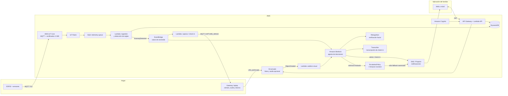

# CareWatch — Arquitectura AWS para el MVP

## Propósito y alcance

CareWatch monitoriza de forma consentida a una persona en su hogar. Un ESP32 recoge telemetría ambiental y de presencia directamente en la nube; una laptop-gateway aporta cámara, micrófono y bocina. La cámara **no toma fotos periódicas**: sólo captura evidencia cuando una anomalía abre un caso.

El MVP puede hacer una llamada de *fallback* al número autorizado para el demo, nunca al 911. Como último recurso, el agente puede invocar la herramienta controlada `emergency_call`; ésta sólo marca tras comprobar riesgo alto, consentimiento explícito, falta de respuesta de la persona y de los familiares alertados, destino permitido e idempotencia. No es una capacidad de telefonía abierta del LLM.

## Arquitectura propuesta

Diagrama editable con iconos oficiales: [aws-architecture-mvp.svg](diagrams/aws-architecture-mvp.svg).



La laptop es un gateway deliberadamente: evita intentar ejecutar cámara, audio, subidas pesadas y modelos en el ESP32. En producción puede sustituirse por una Raspberry Pi, sin cambiar los contratos con la nube.

## Componentes

| Necesidad | Servicio / componente | Decisión para el MVP |
| --- | --- | --- |
| Identidad y conectividad del dispositivo | AWS IoT Core | Un `Thing` y certificado X.509 por ESP32 y por gateway; MQTT sobre TLS. |
| Ingreso confiable de telemetría | IoT Rule + SQS | La cola desacopla al dispositivo de la lógica y permite reintentos. |
| Datos de consulta rápida | DynamoDB | Estado actual, lecturas recientes, alertas, usuarios y vínculos de cuidado. |
| Evidencia multimedia | S3 privado | Fotos con URL prefirmada; sin acceso público. Ciclo de vida con borrado automático. |
| Coordinación de caso | EventBridge + Lambdas | Al detectar anomalía, abre un caso y ordena una captura puntual; no hay temporizador de fotos. |
| Interpretación y decisión | Bedrock + despachador de herramientas | El agente recibe evidencia estructurada, puede pedir verificación facial o check-in de voz, y propone acciones limitadas. |
| Escalamiento telefónico | Herramienta controlada + EscalationPolicy + Amazon Connect | El agente puede activar el último recurso, pero la herramienta valida la política antes de llamar al número autorizado. |
| API de la aplicación | API Gateway + Lambda | REST, autorizada por Cognito. |
| Login y roles | Cognito | Roles mínimos: `caregiver` y `admin`; el usuario sólo accede a sus pacientes/dispositivos. |
| Alertas | SNS (MVP) | Push/SMS/email para demos. Preferir push en una aplicación real para reducir costo y exposición. |

AWS IoT Core usa MQTT y su Rules Engine puede enrutar mensajes hacia S3, DynamoDB, Lambda o SQS; aquí se elige SQS antes de Lambda para tolerar picos y errores transitorios. [Documentación de AWS IoT Core](https://docs.aws.amazon.com/iot/latest/developerguide/aws-iot-how-it-works.html)

## Flujos principales

### 1. Telemetría y presencia

1. El ESP32 publica una lectura cada 30–60 segundos a `carewatch/v1/devices/{deviceId}/telemetry` en AWS IoT Core con su certificado X.509.
2. Una regla IoT envía el mensaje a SQS. Lambda valida el esquema, deduplica por `eventId`, persiste la lectura y actualiza el estado actual.
3. La misma Lambda evalúa reglas deterministas y crea una alerta cuando procede.

### 2. Investigación de una anomalía

1. Una regla abre `AnomalyCase` y publica `carewatch.anomaly.detected` en EventBridge.
2. `captureEvidence` envía al gateway el comando MQTT `CAPTURE_IMAGE`; éste obtiene una URL S3 prefirmada, toma una foto y la sube.
3. El evento de S3 invoca `visionProcessor`, que pide a Bedrock una observación JSON limitada. El agente puede pedir una verificación facial de la persona previamente enrolada como evidencia adicional.
4. Se guarda la evidencia estructurada y su referencia. Una foto sin rostro, incierta o con varias personas no basta por sí sola para concluir una emergencia.

### 3. Alerta y confirmación

1. Con la telemetría, imagen y contexto permitido, el agente decide si pide un check-in de voz y/o alerta al familiar. Ambas acciones se registran en el caso.
2. El gateway formula una pregunta breve; Transcribe convierte la respuesta intencional en texto. La voz sirve como evidencia y comandos, no como identificación biométrica entre sesiones.
3. Si la persona responde o el familiar atiende la alerta, el caso se resuelve o pasa a revisión humana.
4. Al vencer el plazo `x`, el agente puede invocar `emergency_call`. `EscalationPolicy` verifica que no haya respuesta de la persona ni de los familiares alertados, que el riesgo siga alto, que exista consentimiento y que el destino esté en lista permitida. Sólo entonces `EmergencyDialer` usa Amazon Connect para llamar al número configurado. Es idempotente por `caseId`.

## Contratos MQTT iniciales

| Dirección | Topic |
| --- | --- |
| ESP32 → nube | `carewatch/v1/devices/{deviceId}/telemetry` |
| ESP32 → nube | `carewatch/v1/devices/{deviceId}/status` |
| Nube → gateway | `carewatch/v1/devices/{deviceId}/commands` |
| Gateway → nube | `carewatch/v1/devices/{deviceId}/command-acks` |

Ejemplo de telemetría:

```json
{
  "eventId": "01J...",
  "timestamp": "2026-09-23T18:30:00Z",
  "temperatureC": 27.3,
  "humidityPct": 48.1,
  "co2Ppm": 840,
  "proximityCm": 120,
  "motion": false,
  "firmwareVersion": "0.1.0"
}
```

No almacenar audio continuo en el MVP. Si se habilita voz, guardar sólo comandos activados intencionalmente (push-to-talk o palabra de activación), con aviso y consentimiento visible.

## Modelo de datos DynamoDB

| Tabla | PK / SK | Contenido |
| --- | --- | --- |
| `CareRecipients` | `recipientId` | Perfil mínimo, zona horaria, consentimiento, contactos. |
| `CareProfiles` | `recipientId` | Edad, condiciones, medicamentos y contexto manual; propuestas del LLM quedan pendientes de aprobación. |
| `Devices` | `deviceId` | Estado, último contacto, `recipientId`, versión, configuración. |
| `Telemetry` | `deviceId` / `timestamp#eventId` | Lecturas normalizadas; TTL de 30–90 días para MVP. |
| `Alerts` | `recipientId` / `createdAt#alertId` | Severidad, evidencia, estado, confirmación y auditoría. |
| `Observations` | `recipientId` / `capturedAt#imageId` | Resultado de análisis visual y llave de S3. |
| `AnomalyCases` | `caseId` | Estado, evidencia, plazos de respuesta y resultado de escalamiento. |
| `EventLog` | `caseId` / `timestamp#eventId` | Trazabilidad de decisiones, herramientas, alertas y respuestas, sin material biométrico crudo. |
| `CaregiverAccess` | `userId` / `recipientId` | Relación uno-a-muchos de familiares, rol, prioridad y preferencias de alerta. |

## Motor de anomalías: fases

**Hackathon:** reglas interpretables y configurables: CO₂ alto sostenido, temperatura fuera de rango, dispositivo desconectado, inmovilidad fuera de horario esperado, y correlación simple de posible caída visual + falta de movimiento.

**Después:** guardar telemetría etiquetada y entrenar/pilotear detección de anomalías por persona. No presentar un modelo como diagnóstico médico ni actuar sólo por una predicción sin una política de seguridad.

## Seguridad, privacidad y costos

- Consentimiento revocable por persona monitoreada, incluyendo consentimiento independiente para cámara, biometría y la llamada de fallback; indicador físico de cámara/micrófono activos.
- Cifrado TLS en tránsito, S3/DynamoDB cifrados en reposo, mínimo privilegio IAM y certificados distintos por dispositivo.
- Políticas IoT restringidas a los topics de su propio `deviceId`; no usar credenciales AWS estáticas en ESP32 ni gateway.
- S3 privado, bloqueo de acceso público, URLs prefirmadas de corta vida y regla de ciclo de vida (por ejemplo, borrar fotos a los 7 días en demo).
- La verificación facial sólo compara con una identidad enrolada y consentida; el reconocimiento/transcripción de voz es evidencia de check-in, no una identidad biométrica decisiva. No incluir rostros, audio ni identificadores personales en logs ni en prompts más allá de lo indispensable.
- La herramienta del agente `emergency_call` sólo acepta un `caseId`. `EscalationPolicy` exige riesgo alto, ausencia de respuesta de persona y familiares alertados, consentimiento vigente, destino permitido e idempotencia antes de invocar Amazon Connect.
- Para el MVP, `EventLog` conserva la trazabilidad funcional del caso; la observabilidad operativa avanzada queda fuera de alcance.

## Implementación sugerida en orden

1. Infraestructura como código con AWS CDK (TypeScript) o SAM: IoT, SQS, DynamoDB, S3, Lambda, Cognito y API Gateway.
2. Simulador de gateway que publique el JSON anterior; antes de conectar hardware.
3. API de familiares: autenticación, lista de personas, estado actual e historial.
4. Reglas de anomalía y alertas end-to-end.
5. Casos de anomalía: captura a S3 bajo demanda, análisis visual, check-in de voz y alertas.
6. Añadir la política de escalamiento y Amazon Connect sólo con número de demo permitido, aviso de prueba y trazabilidad completa.

## Decisiones aún necesarias

- Región AWS y cuenta disponible para el hackathon.
- Plataforma del cliente: web responsiva (la opción más rápida) o app móvil.
- Sensores que estarán realmente conectados al ESP32; el contrato permite que falten campos.
- Proveedor/modelo de análisis visual y si Bedrock está habilitado en su región. Si no, el adaptador `VisionAnalysisService` permitirá cambiarlo sin rediseñar la plataforma.
